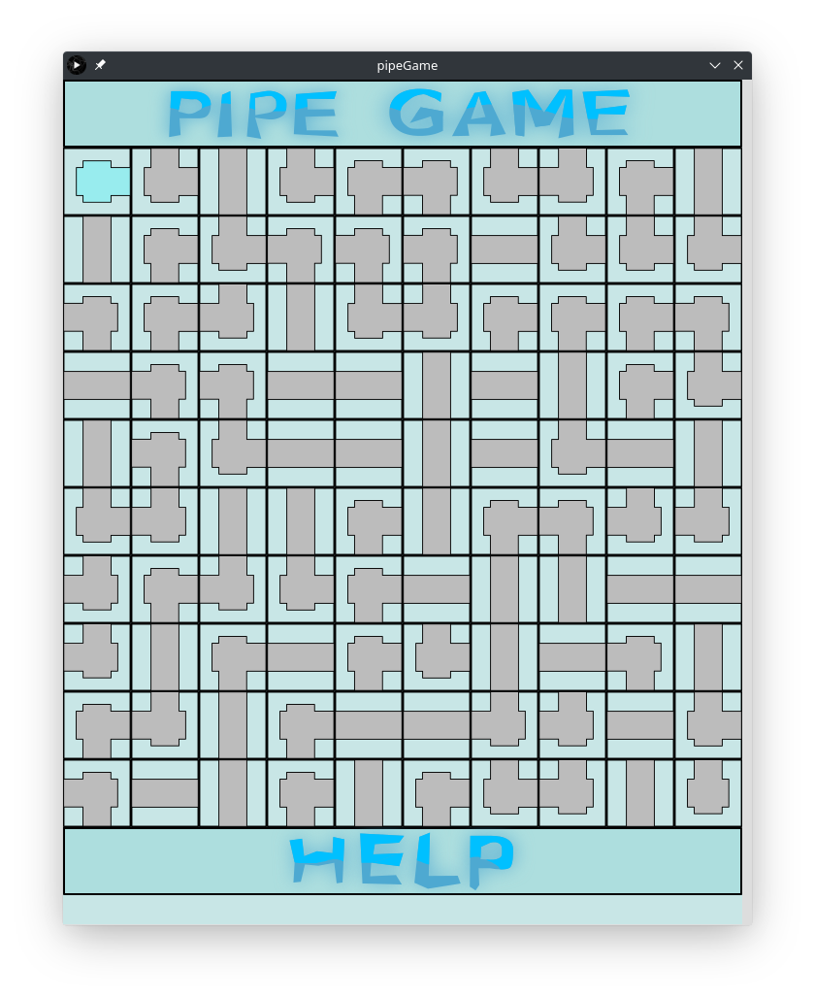
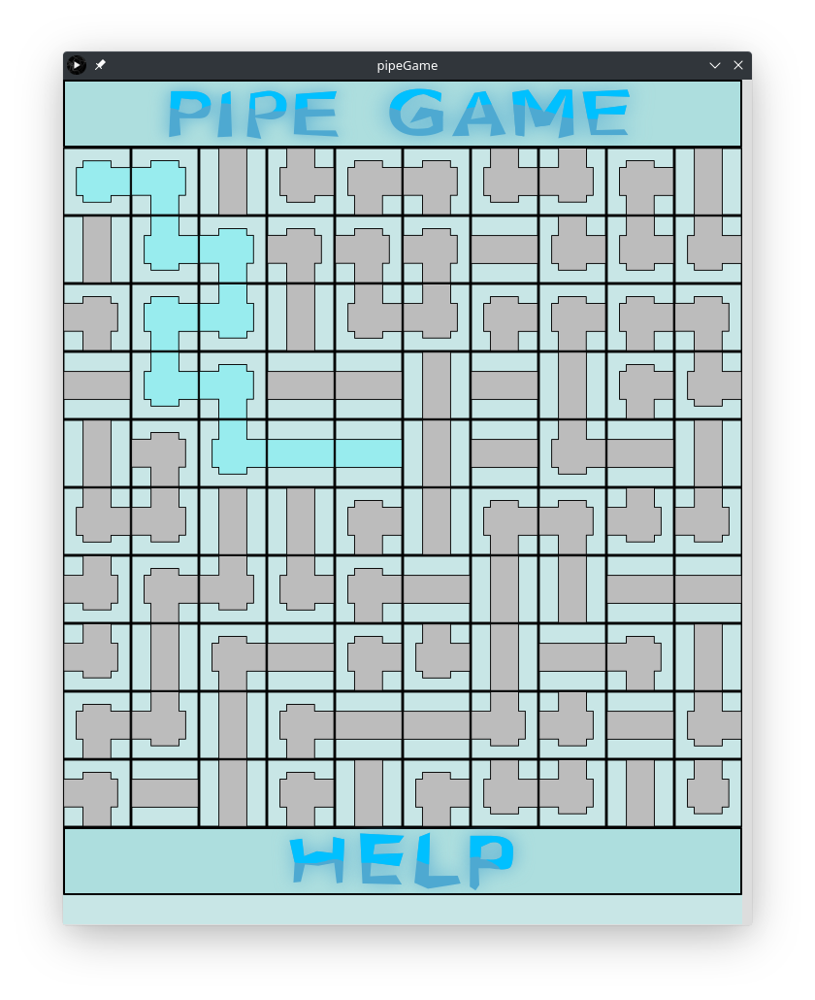
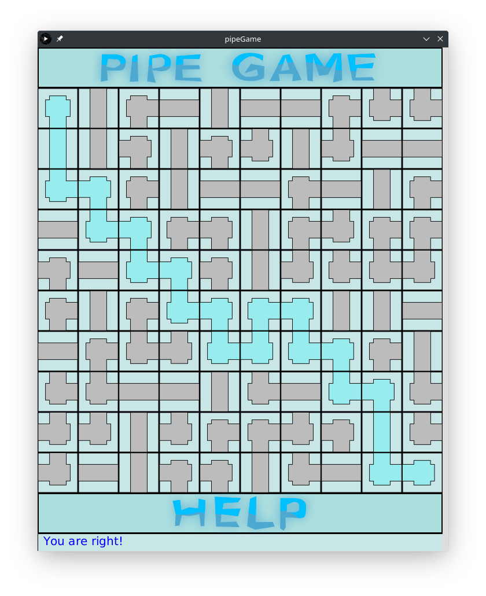

# What's this?
This is a pipe game.

# Requirements
These software should be installed before the system deployment.
* Java
* Processing IDE

# User guide
## First - Compile the game
Compile this game by Processing IDE or get compiled binary files from another compatible computer.

## Second - Have fun with it
* Click "HELP" button to generate new puzzle.
* Click "PIPE GAME" button to get programmer info.
* Status bar is at the bottom of the window. It shows some tips and status for you.
* The pips in top left puzzle and right bottom puzzle are the water supplyer and the end of the water flow separately. They are unable to rotate.
* Click on the remaining puzzles to rotate each pipes. Try to find a route for the water flow.

*Note: Because the puzzle is generated randomly, the number of solution may be zero, one, or more than one.*

# Snapshots

# Copyright
Download the sources and enjoy it! This software is able to be used for commercial.

Any question? Try to sent author an email.

# Author
For more info, please visit [haward79's website](https://www.haward79.tw/) .

